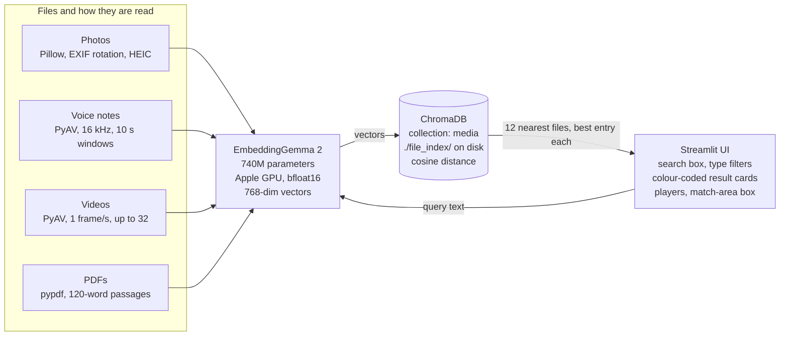

# File Finder — Tech Architecture & Stack

Oct 8, 2026

## Overview

File Finder searches a folder of photos, voice notes, videos and PDFs by plain-English description, entirely offline on a laptop. Type "a white car on the road" or "sleeping on a night train" and it returns the closest files, ranked, from any of the four types.

The core idea is one model for everything. Google's EmbeddingGemma 2 turns every photo, recording, video clip, PDF passage and search query into a 768-number vector in one shared space, so a text query lands near the files that match it. Search is then a nearest-neighbour lookup in a local vector database.

It runs on an Apple M3 Pro (18 GB RAM) using about 3 GB once loaded and up to about 6 GB while indexing photos. The model's 16-bit weights take 1.49 GB on the GPU, the Python process 1.3 GB, and a 16-photo batch grows GPU memory to about 4.9 GB. Google's ~567 MB figure is for a 4/8-bit compressed build on a Pixel phone; this app runs the uncompressed model. Nothing leaves the machine after the one-time model download.

## Architecture

Two paths share one model and one database: indexing (files in, vectors stored) and search (query in, ranked files out).

Indexing reads each file with the right library, cuts it into pieces and stores one vector per piece. A search embeds the query with the same model, fetches the nearest vectors, and keeps the best one per file.

## Tech stack

Ten pinned dependencies, all pure Python wheels or bundled binaries: nothing needs Homebrew, ffmpeg or admin rights.

| Layer | Technology | Version | Why it was chosen |
| --- | --- | --- | --- |
| Embedding model | [google/embeddinggemma-2](https://huggingface.co/google/embeddinggemma-2) | 740M params, Apache 2.0 | One model embeds text, images, audio and video into the same 768-dim space |
| Model runtime | sentence-transformers | 6.1.0 | One-line `.encode()` for every modality, plus the model card's task prompts |
| Model internals | transformers | 5.19.0 | Model and image/audio/video processor implementations |
| Compute | PyTorch on Apple GPU (MPS) | 2.14.1 | bfloat16 halves memory; float16 avoided because the model card warns it gives NaN vectors |
| Image processor dependency | torchvision | 0.29.1 | Required by the model's image processor (not mentioned on the model card) |
| Vector database | ChromaDB | 1.5.9 | Embedded and file-based, no server; four calls (`upsert`, `get`, `query`, `delete`) |
| UI | Streamlit | 1.65.0 | Full web UI in Python, with built-in image, audio and video players |
| Photos | Pillow + pillow-heif | 12.3.0 / 1.8.0 | Image loading, EXIF rotation, thumbnails; HEIC (iPhone photo) support |
| Audio and video | PyAV | 19.0.1 | Decodes iPhone .m4a, H.264 and HEVC with bundled decoders; no ffmpeg install |
| PDFs | pypdf | 6.19.0 | Pure-Python text extraction, page by page |
| Python and environment | Python 3.12 via uv | 3.12.15 / uv 0.12.23 | The Mac's system Python (3.9) was too old; uv installs Python without admin rights |

The app is three Python files: `file_search.py` (core logic), `app.py` (Streamlit UI) and `index_cli.py` (command-line indexer with timings), plus `.streamlit/config.toml` for privacy and theme settings.

## How each file type is processed

Every type ends as one or more 768-dim vectors; what differs is how the file is read and how finely it is cut, so a result can point to the right moment or page.

| Type | Formats | Read with | Cut into | One vector per | Result shows |
| --- | --- | --- | --- | --- | --- |
| Photo | .jpg .jpeg .png .heic | Pillow, EXIF rotation, RGB | Whole image (280 image tokens) | Photo | Thumbnail, optional match-area box |
| Voice note | .m4a .mp3 .wav .ogg .opus | PyAV, resampled to 16 kHz mono | 10 s windows, one every 2.5 s (last window at least 5 s) | Window | Player starting 2 s before the best window |
| Video | .mp4 .mov .m4v | PyAV at 1 frame/s, rotation flag applied, frames shrunk to 768 px | Whole clip, up to 32 frames (spread evenly if longer) | Clip | Video player |
| PDF | .pdf | pypdf, text per page | 120-word passages overlapping by 40, never crossing a page | Passage | Page number, passage text, Open PDF button |

Search queries are embedded with the model card's `SearchQuery` prompt; PDF passages with its document format, `title: <PDF title> | text: <passage>`. All vectors are L2-normalised and compared by cosine similarity.

**Match-area highlighting.** The model gives one vector per photo, so it cannot say where a match is. On request, the photo is cut into a 3x3 grid of overlapping tiles (each half its width and height), each tile is embedded at 140 image tokens and compared with the query, and the best tile is outlined. If the tiles' scores differ by less than 0.045, the app reports that no single area stands out. This runs on click, or automatically on the top 4 photos (about 2 s each).

## Data model

Everything lives in one ChromaDB collection, `media`, stored in `./file_index/` and searched by cosine distance. One entry per vector: a photo or video is one entry, a voice note or PDF is many.

| Field | Example | Purpose |
| --- | --- | --- |
| `id` | `.../memo.m4a#27.5`, `.../notes.pdf#7` | File path, plus window start or passage number for multi-entry files |
| `path` | `/Users/.../photos/cycle_video.mp4` | Groups entries by file; search keeps the best entry per path |
| `type` | `photo` / `voice` / `video` / `document` | Powers the type filter (a Chroma `where` clause) |
| `mtime` | `1791366330066` | Last-modified time in whole milliseconds, for skip-if-unchanged |
| `version` | `2` | `INDEX_VERSION` that made the entry |
| `start` | `27.5` | Voice notes: second the window starts |
| `page`, `text` | `3`, passage words | PDFs: where the passage is and what it says |

**Incremental re-indexing.** A file is skipped when its path is stored with the same `mtime` and the current `version`. An edited file has its old entries deleted and is embedded again, and files that have left the folder are removed from the index. Bumping `INDEX_VERSION` makes the next run redo every file automatically, which is how embedding changes ship without deleting the database.

**Search.** The query vector fetches the 60 nearest entries, keeps the best entry per file, and asks for 4x more until it has 12 different files, so one long PDF or recording cannot fill the results. The UI then hides anything more than 0.10 below the best score.

## Key design decisions

Each choice below was tested on real or generated files before it shipped; the evidence column is what settled it.

| Decision | Alternative rejected | Evidence |
| --- | --- | --- |
| EmbeddingGemma 2 for all four types | CLIP/SigLIP (images only) plus separate models | One 740M model handled photos, speech, video and text; correct top result on every test query |
| No speech-to-text | Whisper transcripts (a second 1–3 GB model) | 5 of 5 voice notes found by queries sharing no words, e.g. "vehicle repair" found a memo about a grinding noise when braking |
| 10 s audio windows every 2.5 s | 30 s pieces; 10 s every 5 s | Found all 4 topic changes in a memo within about 1.5 s; 30 s pieces could be off by 30 s, 5 s steps missed 1 of 4 |
| Document prompt for PDF passages | Plain text | Right passage scored about 0.06 higher; PDFs won their topics (0.77 vs 0.60) but not visual queries (0.59 vs 0.70) |
| Whole-clip video vectors | Per-frame or short windows | Scored the same as the best window or frame, and simpler |
| ChromaDB | LanceDB | Smaller API to explain; scale differences don't matter for a personal library |
| `mtime` stored as integer ms | Float seconds | Chroma rounded floats (`...330.0664499` became `...330.06645`), so 3 unchanged files re-indexed every run |
| Tile spread decides whether to highlight | Best tile vs whole photo | Spread separated cases: under 0.04 for things not in the photo, 0.05+ for real objects |
| 140 tokens per tile | Default 280 | 1.9 s vs 4.1 s per photo; on 8 cases one box got worse, one better |
| Highlight on click or top 4 | During indexing | Indexing would be about 10x slower and the database about 10x bigger |
| Hide results more than 0.10 behind | Always show 12 | "hot air balloons" now shows 2 results instead of 2 plus 10 unrelated ones |

## How it was built

File Finder was built over 7–8 October 2026 with Claude Code, in a series of plan-then-build iterations that grew a photo search MVP into a four-type search tool. Each step was planned and approved first, tested on a local test folder plus generated test files, and checked in the browser.

| Step | What was added | Notable fix or finding |
| --- | --- | --- |
| 11 | Re-indexing removes files that have left the folder; published to GitHub | Deleted videos had been showing as "file moved or deleted" cards |
| 10 | Renamed Photo Finder to File Finder (UI, code module, index folder, project folder) | Virtual environment rebuilt for the new folder path; index rebuilt for the new file paths |
| 9 | Bold, colourful, search-first redesign: gradient header, example-search chips, type filter buttons, colour-coded cards, indexing in a pop-up | A plain `[theme]` setting forced light mode; split into `[theme.light]` and `[theme.dark]` |
| 8 | Auto-highlight on the top 4 photos; unlikely matches hidden | Highlight box was about 1 px wide on screen; now drawn after resizing. Video cap corrected from 50 to the model's real 32 frames |
| 7 | PDF search with page numbers and passages | Search now keeps fetching until it has 12 different files |
| 6 | Video search (H.264, HEVC, portrait iPhone clips) | Model's own video loader needed `torchcodec`; frames read with PyAV instead |
| 5 | Match-area highlighting; finer 10 s audio windows; `INDEX_VERSION` | Result cards reordered after labels were being read against the wrong photo |
| 4 | Voice notes (iPhone .m4a), searched by meaning | Float `mtime` rounding re-indexed unchanged files; stored as integer ms |
| 3 | Match labels (rank, best, close, weak) | Screenshots of text ranked high on short queries: the model reads text in images |
| 2 | Privacy hardening: localhost only, no Hugging Face calls after download, telemetry off | Streamlit's first-run email prompt blocked startup |
| 1 | Photo search MVP: Streamlit page, ChromaDB index, EmbeddingGemma 2 | Model needed `torchvision`, not listed on its card; 14 photos indexed in 7.4 s |

**Build tooling.** uv for Python 3.12 and the virtual environment; Claude Code's built-in browser to drive and screenshot the app; test files generated offline with macOS `say` (speech), `afconvert` (iPhone-style .m4a), `cupsfilter` (PDFs) and PyAV's encoders (H.264, HEVC and rotated videos).

## Privacy and limitations

After the one-time model download, no file, vector or query leaves the laptop.

- **Model:** loaded with `local_files_only=True`; verified by pointing Hugging Face at a dead address and loading successfully.
- **App:** bound to `localhost`, so other devices on the Wi-Fi cannot open it; Streamlit usage statistics off.
- **Database and UI:** ChromaDB telemetry off; system fonts only, since web fonts would be fetched from the internet.

Known limitations:

- Scores are relative: good matches score about 0.65–0.77, unrelated files about 0.55–0.60.
- The match-area box covers a quarter of the photo, not a tight outline, and is skipped for large or vague subjects ("the sky").
- A video is one vector, so content in part of a clip counts for less; its soundtrack is not searched.
- Scanned PDFs (no text layer) are skipped; Open PDF opens page 1, with the matching page shown on the card.
- HEVC videos are indexed but may not play in Chrome (Safari plays them).
- Indexing 4K video is slow (about 16 s per clip), almost all of it spent decoding frames.

Natural next steps are indexing video soundtracks as voice notes and rendering scanned PDF pages as images.
